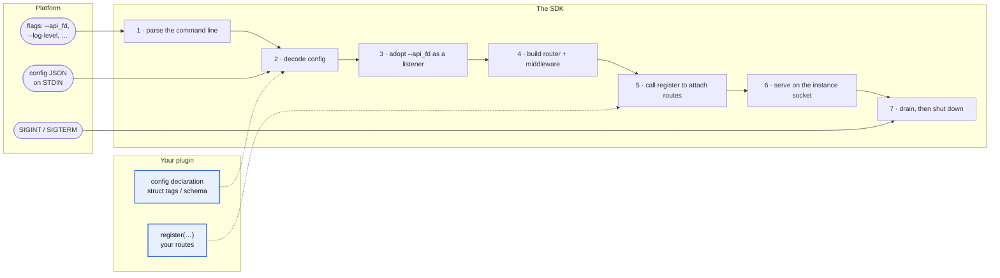

# Unikraft Cloud Plugin SDKs

SDKs for building **Unikraft Cloud plugins**, one per language.

A plugin is a sidecar HTTP server that the platform loads next to your main
application, from its own [ROM image](https://unikraft.com/docs/features/roms),
and reaches over a per-instance, authenticated endpoint.

Writing a plugin by hand means re-implementing the same boilerplate every time
to be compatible with the [Unikraft Cloud instance plugin
substrate](https://unikraft.com/docs/features/plugins): parsing the `init`
command line, adopting the socket the platform hands you, decoding the JSON
configuration from `STDIN`, standing up a router with sane middleware, wiring
graceful shutdown, and integrating scale-to-zero.

These SDKs do all of that for you. You write a **configuration declaration** and
a **route registration function**; the SDK does the rest. A complete plugin is
about 20 lines.

| Language | Package                        | Guide                            |
| -------- | ------------------------------ | -------------------------------- |
| Go       | `unikraft.com/cloud/pluginsdk` | [`go/README.md`](./go/README.md) |

This document covers everything that is the same in both languages: the platform
contract, the configuration model, the response envelope, the runtime lifecycle,
and how a plugin is packaged and deployed.  Each language guide covers only what
is specific to it: installation, the quickstart, the API reference, and how the
concepts below map onto that language's idioms.

---

## Table of contents

- [Unikraft Cloud Plugin SDKs](#unikraft-cloud-plugin-sdks)
	- [Table of contents](#table-of-contents)
	- [The plugin model](#the-plugin-model)
		- [The image](#the-image)
		- [The endpoint](#the-endpoint)
		- [Properties worth knowing](#properties-worth-knowing)
		- [Constraints](#constraints)
	- [What the SDKs give you](#what-the-sdks-give-you)
	- [Configuration](#configuration)
		- [Where values come from](#where-values-come-from)
		- [The platform `config` JSON](#the-platform-config-json)
		- [Global flags](#global-flags)
	- [Responses](#responses)
	- [Lifecycle \& runtime](#lifecycle--runtime)
		- [Choosing the listener](#choosing-the-listener)
	- [Scale-to-zero](#scale-to-zero)
	- [Logging](#logging)
	- [Project layout](#project-layout)
	- [Building \& packaging](#building--packaging)
		- [`Dockerfile`](#dockerfile)
		- [`Kraftfile`](#kraftfile)
	- [Deploying](#deploying)
		- [Licence](#licence)

---

## The plugin model

The SDKs exist to satisfy one contract, defined by the platform. You do not need
to memorise it as the SDKs encapsulate it, but understanding it explains every
design decision below.

### The image

A plugin ships as a standard ROM image with a single executable named `init`
in its root. The platform:

1. Loads the image and mounts it at `/uk/plugins/<plugin_name>`.
2. Runs `init` when the plugin starts.
3. Hands `init` **two things**:
   - **Configuration on `STDIN`** — whatever you put in the plugin's `config`
     field of the create-instance request arrives on `init`'s standard input as
     JSON. Any JSON value is valid: an object, a string, or a number.
   - **A socket file descriptor** — the platform passes `--api_fd <n>`, where
     `n` is the file descriptor the plugin must `accept(2)` connections on. The
     plugin serves all of its API traffic on this socket, **not** on a port it
     opens itself.

So the platform effectively runs:

```
/uk/plugins/<plugin_name>/init --api_fd <n> < <config>
```

### The endpoint

Clients reach a plugin through the instance's authenticated API endpoint:

```
https://api.<metro>.unikraft.cloud/v1/instances/<uuid>/plugins/<plugin_name>/<path>
```

Everything after `<plugin_name>/` is forwarded to the plugin as the request
path. A request to `.../plugins/my-plugin/files/list` arrives at your plugin as
`GET /files/list`.

> **Routing implication:** your routes are defined relative to your plugin's own
> root (`/files/list`, `/v1/...`). The `plugins/<plugin_name>/` prefix is
> stripped by the platform before the request reaches you. Your plugin never
> needs to know its own name to route correctly.

### Properties worth knowing

- **Authenticated like any API call.** The platform verifies the caller owns the
  instance before forwarding. You do not implement auth.
- **A direct line to one instance.** No load balancing, no autoscale, no service
  group in the path.
- **Works with scale-to-zero.** An idle instance is woken to serve a plugin
  request. Long-running work should hold the instance awake explicitly (see
  [scale-to-zero](#scale-to-zero)).
- **Reloaded across the lifecycle.** Plugins return with the instance after
  scale-to-zero, suspend, or restart, and are inherited by clones, branches,
  forks, checkpoints, and on-demand templates.

### Constraints

| Rule                     | Value                               |
| ------------------------ | ----------------------------------- |
| Max plugins per instance | 8                                   |
| Plugin name length       | ≤ 63 characters                     |
| Plugin name charset      | `a`–`z`, `A`–`Z`, `0`–`9`, `-`, `_` |

Full platform documentation:
<https://unikraft.com/docs/features/plugins>.

---

## What the SDKs give you

Each SDK turns the contract above into a two-part declaration: you write the two
highlighted boxes, the SDK runs the numbered steps.



Concretely, each SDK owns:

- **Command-line parsing** — the platform's `--api_fd`, plus `--api-addr`,
  `--log-level` and `--log-type`, and every field of your own configuration as a
  flag.
- **Configuration decoding** — reads the JSON `config` from `STDIN` and merges it
  with environment variables and command-line flags into one typed value
  (see [configuration](#configuration)).
- **Socket adoption** — turns the `--api_fd` file descriptor into a listening
  server so you serve exactly where the platform expects.
- **HTTP routing** with a default middleware stack: CORS, static headers, request
  logging, and cache control.
- **Lifecycle** — `SIGINT`/`SIGTERM` handling, startup, graceful drain.
- **Batteries** — the standard response envelope (see [responses](#responses)) and a
  scale-to-zero helper (see [scale-to-zero](#scale-to-zero)).

The two SDKs share this model but not their identifiers; each language uses its
own idioms. Where a name differs it is called out in that language's guide.

---

## Configuration

A plugin's configuration is declared once — as a struct with tags in Go, as a
[zod][zod] schema in TypeScript — and that declaration is the single source of
truth. It validates the platform `config`, supplies defaults, and derives the
command-line flags and environment variables.

### Where values come from

A plugin can be configured three ways. Both SDKs merge them with the same
precedence, from lowest to highest:

```
declared default  <  platform `config` (STDIN JSON)  <  environment  <  CLI flag
```

- **Declared default** — the fallback baked into the binary (`default:"…"` in
  Go, `.default(…)` in TypeScript).
- **Platform `config` (STDIN)** — the JSON object you pass in the `config` field
  when creating the instance. This is the production path.
- **Environment** — any field bound to an environment variable.
- **CLI flag** — an explicit flag on the command line. Mostly for local
  development and debugging.

So a field defaulting to `/tmp` is `/tmp` unless the platform `config` sets
`"workdir":"/data"`, unless `WORKDIR=/srv` is in the environment, unless
`--workdir /mnt` is on the command line.

### The platform `config` JSON

When you create an instance you may attach a `config` to each plugin:

```json
{
  "name": "example",
  "rom": "user/example:latest",
  "config": { "greeting": "Bonjour" }
}
```

The JSON keys map onto your configuration's fields. Note that the config key is
independent of the flag name: a field whose config key is `source_type` is still
`--source-type` on the command line.

The platform also permits **non-object** config — a bare string or number is
valid JSON too. When the config is not a JSON object it cannot map onto fields;
each SDK exposes the raw bytes as delivered on `STDIN` so you can decode unusual
shapes yourself (`RawConfig(ctx)` in Go, `rawConfig()` in TypeScript).

### Global flags

Every plugin gets these four flags regardless of its own configuration:

| Flag                | Env         | Meaning                                                  |
| ------------------- | ----------- | -------------------------------------------------------- |
| `--api_fd <n>`      | `API_FD`    | Serve on file descriptor `n` (the platform path)         |
| `--api-addr <addr>` | `API_ADDR`  | Serve on a TCP address, e.g. `:8080` (local development) |
| `--log-level`       | `LOG_LEVEL` | `trace`, `debug`, `info`, `warn`, `error`, `fatal`       |
| `--log-type`        | `LOG_TYPE`  | `text` or `json`                                         |

Note the inconsistent separator: `--api_fd` is snake-case because the platform
defines it that way; every other flag is kebab-case.

[zod]: https://zod.dev

---

## Responses

The platform's REST APIs use a standard response envelope (`common.tsp`):

```jsonc
{
  "status": "success", // or "partial_success", or "error"
  "message": "optional detail",
  "data": { /* payload */ },
  "errors": [ { "status": 400 } ]
}
```

Each SDK provides helpers so your plugin matches this without hand-rolling JSON:
one to wrap a payload as a success envelope, one to build an error envelope. See
the language guide for the exact signatures — they differ meaningfully between Go
and TypeScript.

---

## Lifecycle & runtime

Both SDKs run the same sequence:

1. **Parse** the command line and decode the `STDIN` config.
2. **Bind** the listener: `--api_fd` in production, `--api-addr` locally.
3. **Configure logging** from `--log-level` / `--log-type`.
4. **Build** the router with default + user middleware, then call your
   registration function.
5. **Serve** on the listener.
6. **Block** until a signal (or your own cancellation).
7. **Drain**: stop accepting connections, finish in-flight requests, shut down.

### Choosing the listener

If `--api_fd` is set it wins; otherwise the SDK falls back to `--api-addr`.
Exactly one must resolve or startup fails with a clear error. There is no
platform socket during local development, so pass `--api-addr` and feed the
config on `STDIN`:

```console
$ echo '{"greeting":"Hey"}' | ./init --api-addr :8080 --log-type text
$ curl -s localhost:8080/hello
{"status":"success","data":{"message":"Hey, world!"}}
```

---

## Scale-to-zero

An idle instance can be put to sleep by
[scale-to-zero](https://unikraft.com/docs/features/scale-to-zero). If your
plugin starts background work that must outlive the request that triggered it
(a long-running command, a stream), hold the instance awake for the duration.

Both SDKs ship a scale-to-zero sub-package that increments and decrements a
counter around the work. It is a **counter**, not a flag: many independent
workers can increment and decrement without coordinating. While the count is
above zero, scale-to-zero is suspended; at zero it resumes. Set, increment-by and
decrement-by variants are available in both languages.

Internally these write to the platform pseudo-file
`/uk/libukp/scale_to_zero_disable`.

---

## Logging

Each SDK configures a structured logger from `--log-level` and `--log-type`
(defaults: `info` and `text`) and makes it reachable from your handlers. In
production, set `--log-type json`.

The Go SDK uses [`unikraft.com/x/log`][xlog]; the TypeScript SDK uses
[pino][pino]. The flags, levels and types are identical.

[xlog]: https://unikraft.com/x/log
[pino]: https://getpino.io

---

## Project layout

A plugin built on either SDK follows this convention — the API description and
image recipes sit next to the source:

```
plugins/<plugin_name>/
├── api.tsp          # TypeSpec API description (optional but recommended)
├── openapi.yaml     # generated from api.tsp
├── <entrypoint>     # main.go, or index.ts
├── api/             # generated service: interface, models, register function
├── Dockerfile       # builds the single `init` executable into a scratch image
├── Kraftfile        # ROM image recipe
└── Taskfile.yml     # build / test / package tasks
```

For a trivial plugin, the entrypoint plus `Dockerfile` and `Kraftfile` is enough
— the TypeSpec pieces are optional. The per-language manifests
(`go.mod`, or `package.json` + `tsconfig.json`) sit alongside the entrypoint.

---

## Building & packaging

The deliverable is a ROM image containing a single `init` executable at its
root. The platform appends `--api_fd <n>` and pipes the `config` JSON to `STDIN`
at launch, so `/init` must be the SDK-based binary that understands them.

Because a plugin runs as a process inside the host instance rather than as its
own unikernel, `init` must be **self-contained**. Go produces this naturally; for
TypeScript you compile the bundle into a standalone executable (see the
[JavaScript guide](./javascript/README.md)).

### `Dockerfile`

A build stage that produces `init`, copied into a `scratch` image:

```dockerfile
FROM scratch
COPY --from=build /plugin/dist/init /init
ENTRYPOINT ["/init"]
```

The build stage differs per language — see the language guides.

### `Kraftfile`

A plugin ships as a **rootfs-only ROM** — it carries no kernel of its own.  The
platform mounts it at `/uk/plugins/<name>` inside the host instance and runs its
`init`.  Declare only a `rootfs` (built as `erofs`) and do **not** set a
`runtime`:

```yaml
spec: v0.7

rootfs:
  source: ./Dockerfile
  format: erofs
```

> The platform runs the image's `init` and appends `--api_fd`; it does not use a
> `cmd`, so you need not set one.  Do **not** add a `runtime:` — that produces a
> bootable unikernel that the plugin loader cannot mount, and the host instance
> then fails to boot.  Never hard-code `--api_fd` yourself.

---

## Deploying

Attach the plugin when you create an instance, referencing the ROM image and an
optional `config` (which arrives on your plugin's `STDIN`):

```bash
unikraft api /v1/instances \
  -d '{
    "name": "my-instance",
    "plugins": [
      {
        "name": "example",
        "rom": "user/example:latest",
        "config": { "greeting": "Bonjour" }
      }
    ]
  }'
```

Then call it through the instance's authenticated endpoint:

```bash
curl https://api.<metro>.unikraft.cloud/v1/instances/<uuid>/plugins/example/hello
```

Plugins can also be added to an existing instance with `PATCH /instances`
(`prop: "plugins"`); the change applies while the instance is `stopped`. See the
[platform docs](https://unikraft.com/docs/features/plugins) for the full API.

---

### Licence

BSD-3-Clause. See [`LICENSE.md`](./LICENSE.md).
